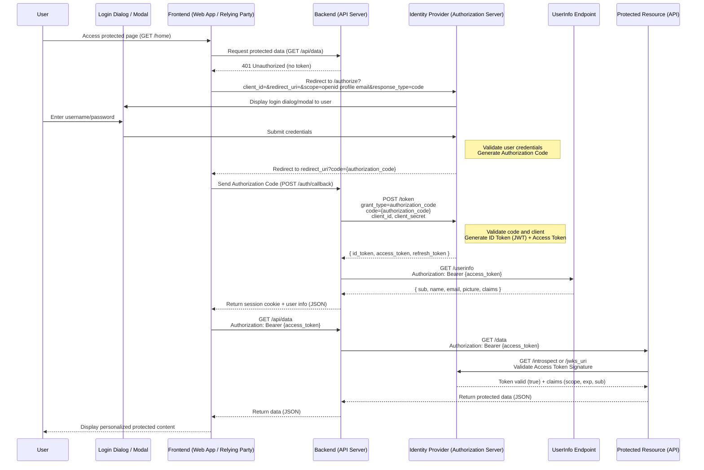

# architecture-oidc
Architecture diagram in mermaid format for an OIDC flow, indicating the critical architecture components and interactions.

```mermaid
sequenceDiagram
    %% Participants
    participant User
    participant LoginUI as Login Dialog / Modal
    participant Frontend as Frontend (Web App / Relying Party)
    participant Backend as Backend (API Server)
    participant IdP as Identity Provider (Authorization Server)
    participant UserInfo as UserInfo Endpoint
    participant Resource as Protected Resource (API)

    %% --- Initial Access Attempt ---
    User ->> Frontend: Access protected page (GET /home)
    Frontend ->> Backend: Request protected data (GET /api/data)
    Backend -->> Frontend: 401 Unauthorized (no token)

    %% --- Authorization Request ---
    Frontend ->> IdP: Redirect to /authorize?<br/>client_id=&redirect_uri=&scope=openid profile email&response_type=code
    IdP ->> LoginUI: Display login dialog/modal to user
    User ->> LoginUI: Enter username/password
    LoginUI ->> IdP: Submit credentials
    Note right of IdP: Validate user credentials<br/>Generate Authorization Code
    IdP -->> Frontend: Redirect to redirect_uri?code={authorization_code}

    %% --- Token Exchange ---
    Frontend ->> Backend: Send Authorization Code (POST /auth/callback)
    Backend ->> IdP: POST /token<br/>grant_type=authorization_code<br/>code={authorization_code}<br/>client_id, client_secret
    Note right of IdP: Validate code and client<br/>Generate ID Token (JWT) + Access Token
    IdP -->> Backend: { id_token, access_token, refresh_token }

    %% --- UserInfo Retrieval ---
    Backend ->> UserInfo: GET /userinfo<br/>Authorization: Bearer {access_token}
    UserInfo -->> Backend: { sub, name, email, picture, claims }

    %% --- Return Session / Token ---
    Backend -->> Frontend: Return session cookie + user info (JSON)

    %% --- Access Protected Resource ---
    Frontend ->> Backend: GET /api/data<br/>Authorization: Bearer {access_token}
    Backend ->> Resource: GET /data<br/>Authorization: Bearer {access_token}

    %% --- Token Validation by Resource Server ---
    Resource ->> IdP: GET /introspect or /jwks_uri<br/>Validate Access Token Signature
    IdP -->> Resource: Token valid (true) + claims (scope, exp, sub)
    Resource -->> Backend: Return protected data (JSON)
    Backend -->> Frontend: Return data (JSON)
    Frontend -->> User: Display personalized protected content
```
